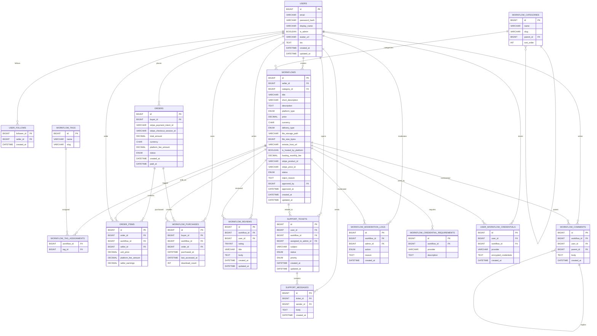

# Workflow-Marktplatz – Datenbank-Dokumentation

Dieses Dokument beschreibt das **relationale Datenbankmodell** (MySQL/MariaDB) für deinen Workflow-Marktplatz.

---

## 1. System-Überblick

Deine Plattform ist ein **Marktplatz für digitale Workflows** (zuerst n8n, später erweiterbar):

- Nutzer können gleichzeitig **Käufer und Verkäufer** sein.
- Verkäufer laden **Workflows** (z. B. JSON-Dateien) hoch und setzen einen Preis.
- Käufe werden über **Stripe** abgewickelt, die Plattform erhält eine **Provision**.
- Nach erfolgreicher Zahlung wird der Workflow in der **Bibliothek** des Nutzers freigeschaltet.
- Workflows besitzen **Kategorien + Tags**, können bewertet & kommentiert werden.
- Es gibt ein **Follow-System**, ein **Support-Ticketsystem** und **Moderation** durch Admins.
- Perspektivisch: Hosting durch die Plattform & **Credential-Handling** (z. B. Gmail API).

---

## 2. Relationales Datenmodell (MySQL/MariaDB)

### 2.1 ER-Diagramm (Mermaid)



---

### 2.2 Tabellen im Überblick

#### 2.2.1 `users`

Zentrale User-Tabelle. Ein User kann Käufer, Verkäufer und/oder Admin sein.

Wichtige Spalten:
- `id`, `email`, `password_hash`
- `display_name`, `avatar_url`, `bio`
- `is_admin`
- `created_at`, `updated_at`

Beziehungen:
- 1:N zu `workflows` (seller)
- 1:N zu `orders` (buyer)
- 1:N zu `workflow_reviews`, `workflow_comments`
- 1:N zu `support_tickets`
- 1:N zu `workflow_moderation_logs`

#### 2.2.2 `workflow_categories`

Hierarchische Kategorien für Workflows (z. B. „Marketing → E-Mail“).

Wichtige Spalten:
- `id`, `name`, `slug`
- `parent_id` (self-reference)
- `sort_order`

Beziehungen:
- 1:N zu `workflows`
- self-referenziell (Parent/Child-Struktur)

#### 2.2.3 `workflows`

Digitale Produkte / n8n-Workflows.

Wichtige Spalten:
- `seller_id` – User, der verkauft
- `category_id` – Kategorie
- `title`, `short_description`, `description`
- `platform_type` – z. B. `'n8n'`
- `price`, `currency`
- `delivery_type` – `'file_download'` oder `'remote_hosted'`
- `file_storage_path`, `file_size_bytes`
- `remote_host_url`
- `is_hosted_by_platform`, `hosting_monthly_fee`
- `stripe_product_id`, `stripe_price_id`
- `status`, `approved_by`, `approved_at`, `reject_reason`

Beziehungen:
- N:1 zu `users` (seller)
- N:1 zu `workflow_categories`
- N:M zu `workflow_tags`
- 1:N zu `workflow_reviews`, `workflow_comments`, `support_tickets`
- 1:N zu `workflow_purchases`
- 1:N zu `workflow_moderation_logs`

#### 2.2.4 `workflow_tags` & `workflow_tag_assignments`

Tags zur feineren Klassifizierung (z. B. „gmail“, „slack“, „crm“).

- `workflow_tags` enthält die Tag-Definition
- `workflow_tag_assignments` verknüpft Workflows mit Tags (N:M)

#### 2.2.5 `orders`, `order_items`, `workflow_purchases`

- `orders` repräsentiert eine Bestellung (Stripe-Checkout, Payment Intent)
- `order_items` sind einzelne Produkte in einer Bestellung
- `workflow_purchases` ist die Bibliothek: Welche User besitzen welche Workflows

Typischer Ablauf:
1. Bestellung in `orders` + `order_items` anlegen (`status = 'pending'`).
2. Stripe-Zahlung bestätigt → `orders.status = 'paid'`.
3. `workflow_purchases` Einträge erstellen → Workflows erscheinen in der Bibliothek.

#### 2.2.6 `workflow_reviews` & `workflow_comments`

- `workflow_reviews`: 1 Bewertung pro User & Workflow (Rating 1–5).
- `workflow_comments`: Kommentare mit optionalem `parent_id` für Threads.

#### 2.2.7 `user_follows`

Repräsentiert „User folgt Verkäufer“.

Spalten:
- `follower_id`
- `seller_id`
- `created_at`

#### 2.2.8 `support_tickets` & `support_messages`

- `support_tickets`: Tickets für Probleme/Support zu einem Workflow.
- `support_messages`: Nachrichtenverlauf im Ticket (User & Admins).

#### 2.2.9 `workflow_moderation_logs`

Protokolliert Moderationsaktionen:

- `action`: `'submitted' | 'approved' | 'rejected' | 'disabled'`
- `reason`: Optionaler Kommentar
- `admin_id`: Verantwortlicher Moderator

#### 2.2.10 Credentials (optional)

Für zukünftiges Remote-Hosting und API-Credentials:

- `workflow_credential_requirements`: Welche Credentials benötigt ein Workflow?
- `user_workflow_credentials`: Verschlüsselte Credentials pro User & Workflow.

---

## 3. Typische SQL-Beispiele

### 3.1 Alle Kategorien

```sql
SELECT * FROM workflow_categories ORDER BY sort_order, name;
```

### 3.2 Alle Workflows einer Kategorie

```sql
SELECT w.*
FROM workflows w
JOIN workflow_categories c ON w.category_id = c.id
WHERE c.slug = 'marketing'
  AND w.status = 'published';
```

### 3.3 Bibliothek eines Users

```sql
SELECT w.*
FROM workflow_purchases p
JOIN workflows w ON p.workflow_id = w.id
WHERE p.buyer_id = ?;
```

---

Diese Datei dokumentiert die **komplette Datenbankstruktur** deines Workflow-Marktplatzes.
