# Workflow-Marktplatz – UML- & Domain-Modell (React + TypeScript)

Dieses Dokument beschreibt das **UML-/Domain-Modell** deines Workflow-Marktplatzes aus Sicht eines **React + TypeScript** Frontends.

Es orientiert sich an den API-Responses und soll dir helfen, saubere **TypeScript-Typen** und **Komponenten-Strukturen** aufzubauen.

---

## 1. Ziele des Modells

- Abbildung aller wichtigen Entitäten:
  - User, Workflows, Kategorien, Tags
  - Bestellungen & Käufe (Bibliothek)
  - Bewertungen, Kommentare
  - Follows
  - Support-System
  - Moderation
  - (Optional) Credential-Management
- Grundlage für:
  - TypeScript-Interfaces
  - React Query / Zustand / Redux Stores
  - API-Contracts (REST, GraphQL, tRPC)

---

## 2. UML Klassendiagramm (Mermaid)

```mermaid
classDiagram

class User {
    +id: number
    +email: string
    +displayName: string
    +isAdmin: boolean
    +avatarUrl?: string
    +bio?: string
    +createdAt: string
    +updatedAt: string
}

class UserFollow {
    +followerId: number
    +sellerId: number
    +createdAt: string
}

class WorkflowCategory {
    +id: number
    +name: string
    +slug: string
    +parentId?: number
    +sortOrder: number
}

class WorkflowTag {
    +id: number
    +name: string
    +slug: string
}

class WorkflowTagAssignment {
    +workflowId: number
    +tagId: number
}

class Workflow {
    +id: number
    +sellerId: number
    +categoryId?: number

    +title: string
    +shortDescription?: string
    +description: string

    +platformType: "n8n" | "zapier" | "make" | "python" | "other"
    +price: number
    +currency: string
    +deliveryType: "file_download" | "remote_hosted"

    +fileStoragePath?: string
    +fileSizeBytes?: number

    +remoteHostUrl?: string
    +isHostedByPlatform: boolean
    +hostingMonthlyFee?: number

    +stripeProductId?: string
    +stripePriceId?: string

    +status: "draft" | "pending_review" | "published" | "rejected" | "disabled"
    +rejectReason?: string

    +approvedBy?: number
    +approvedAt?: string
    +createdAt: string
    +updatedAt: string
}

class Order {
    +id: number
    +buyerId: number
    +stripePaymentIntentId?: string
    +stripeCheckoutSessionId?: string
    +totalAmount: number
    +currency: string
    +platformFeeAmount: number
    +status: "pending" | "paid" | "failed" | "refunded"
    +createdAt: string
    +paidAt?: string
}

class OrderItem {
    +id: number
    +orderId: number
    +workflowId: number
    +sellerId: number
    +unitPrice: number
    +platformFeeAmount: number
    +sellerEarnings: number
}

class WorkflowPurchase {
    +id: number
    +buyerId: number
    +workflowId: number
    +orderId: number
    +purchasedAt: string
    +lastAccessedAt?: string
    +downloadCount: number
}

class WorkflowReview {
    +id: number
    +workflowId: number
    +userId: number
    +rating: number
    +title?: string
    +body?: string
    +createdAt: string
    +updatedAt: string
}

class WorkflowComment {
    +id: number
    +workflowId: number
    +userId: number
    +parentId?: number
    +body: string
    +createdAt: string
}

class SupportTicket {
    +id: number
    +userId: number
    +workflowId?: number
    +assignedToAdminId?: number
    +subject: string
    +status: "open" | "in_progress" | "resolved" | "closed"
    +priority: "low" | "medium" | "high" | "urgent"
    +createdAt: string
    +updatedAt: string
}

class SupportMessage {
    +id: number
    +ticketId: number
    +senderId: number
    +body: string
    +createdAt: string
}

class WorkflowModerationLog {
    +id: number
    +workflowId: number
    +adminId: number
    +action: "submitted" | "approved" | "rejected" | "disabled"
    +reason?: string
    +createdAt: string
}

class WorkflowCredentialRequirement {
    +id: number
    +workflowId: number
    +provider: string
    +description?: string
}

class UserWorkflowCredential {
    +id: number
    +userId: number
    +workflowId: number
    +provider: string
    +encryptedCredentials: string
    +createdAt: string
}

User "1" --> "*" Workflow : creates
User "1" --> "*" UserFollow : follows
User "1" --> "*" Order : places
User "1" --> "*" WorkflowPurchase : owns
User "1" --> "*" WorkflowReview : writes
User "1" --> "*" WorkflowComment : writes
User "1" --> "*" SupportTicket : opens
User "1" --> "*" SupportMessage : sends
User "1" --> "*" WorkflowModerationLog : moderates
User "1" --> "*" UserWorkflowCredential : credentials

WorkflowCategory "1" --> "*" WorkflowCategory : children
WorkflowCategory "1" --> "*" Workflow : categorized

Workflow "1" --> "*" WorkflowTagAssignment : tagAssignments
WorkflowTag "1" --> "*" WorkflowTagAssignment : tagLinks

Order "1" --> "*" OrderItem : items
Workflow "1" --> "*" WorkflowPurchase : purchases
Workflow "1" --> "*" WorkflowReview : reviews
Workflow "1" --> "*" WorkflowComment : comments
WorkflowComment "1" --> "*" WorkflowComment : replies

SupportTicket "1" --> "*" SupportMessage : messages
Workflow "1" --> "*" SupportTicket : relatedTickets

Workflow "1" --> "*" WorkflowModerationLog : moderationLogs
Workflow "1" --> "*" WorkflowCredentialRequirement : credentialRequirements
Workflow "1" --> "*" UserWorkflowCredential : userCredentials
```



---

## 3. Mögliche TypeScript-Interfaces

Diese UML-Struktur lässt sich direkt in **TypeScript-Typen** übersetzen, z. B.:

```ts
export interface User {
  id: number;
  email: string;
  displayName: string;
  isAdmin: boolean;
  avatarUrl?: string;
  bio?: string;
  createdAt: string;
  updatedAt: string;
}

export interface WorkflowCategory {
  id: number;
  name: string;
  slug: string;
  parentId?: number;
  sortOrder: number;
}

export interface Workflow {
  id: number;
  sellerId: number;
  categoryId?: number;
  title: string;
  shortDescription?: string;
  description: string;
  platformType: 'n8n' | 'zapier' | 'make' | 'python' | 'other';
  price: number;
  currency: string;
  deliveryType: 'file_download' | 'remote_hosted';
  fileStoragePath?: string;
  fileSizeBytes?: number;
  remoteHostUrl?: string;
  isHostedByPlatform: boolean;
  hostingMonthlyFee?: number;
  stripeProductId?: string;
  stripePriceId?: string;
  status: 'draft' | 'pending_review' | 'published' | 'rejected' | 'disabled';
  rejectReason?: string;
  approvedBy?: number;
  approvedAt?: string;
  createdAt: string;
  updatedAt: string;
}
```

(Analog kannst du für alle anderen Klassen Interfaces erzeugen.)

---

## 4. Nutzung im React-Frontend

### 4.1 Typische Screens & verwendete Modelle

- **Startseite / Marketplace**  
  - `Workflow[]` mit zugehörigen `WorkflowCategory` und `User` (Seller)
  - Filter nach Kategorie, Preis, Tags

- **Workflow-Detailseite**
  - `Workflow`
  - `User` (Seller)
  - `WorkflowReview[]`
  - `WorkflowComment[]` (Thread)
  - Information, ob der eingeloggte User den Workflow bereits gekauft hat (`WorkflowPurchase`)

- **Bibliothek („Meine Workflows“)**
  - `WorkflowPurchase[]` + zugehörige `Workflow`-Daten

- **Admin-Moderation**
  - `Workflow[]` mit `status = 'pending_review'`
  - `WorkflowModerationLog[]` pro Workflow

- **Support-Bereich**
  - `SupportTicket[]` + `SupportMessage[]`

---

## 5. Vorteile dieser Struktur

- **Gute Trennung** von:
  - Datenbankstruktur (Relations)  
  - Frontend-Domain-Modell (DTOs / Interfaces)  

- **Erweiterbar**:
  - Neue Plattformtypen für Workflows (z. B. `platformType`)  
  - Zusätzliche Felder (z. B. „Schwierigkeit“, „Laufzeit“, „abhängige Services“)

- **Ideal für:**
  - React + Next.js (SSR/SPA)
  - React Query / SWR zur Datenabfrage
  - Typsichere Kommunikation mit einem Node/NestJS-Backend

---

Diese Datei dokumentiert das **komplette UML-/Domain-Modell** für dein React + TypeScript Frontend.
